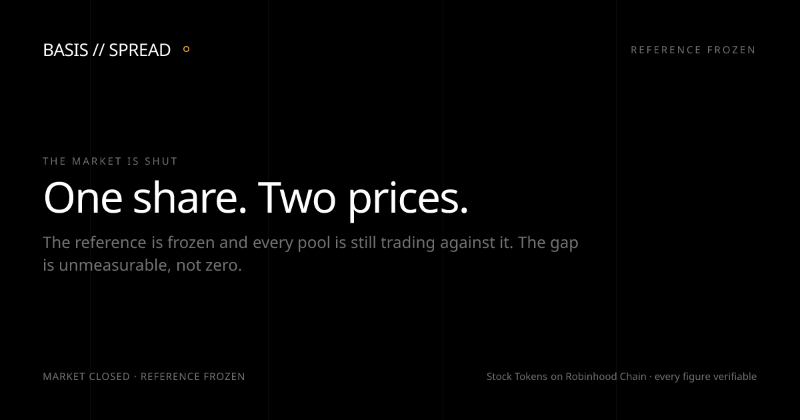

# basis

**The distance between what a share is worth and what its token just traded for.**

A Stock Token on Robinhood Chain is meant to be worth the underlying share. In a Uniswap
pool it is worth whatever the last buyer paid. Nothing forces those two numbers to agree.
basis measures the gap — for every token, once a minute, with the market session attached
so a reader knows whether the reference behind it was even alive.

```
basis = ( pool / ( mid × uiMultiplier ) − 1 ) × 10 000     // basis points
```

---

[](https://github.com/basisinvestments/basis/actions/workflows/ci.yml)
[](https://melodic-syrniki-2d566a.netlify.app)


**Live:** [melodic-syrniki-2d566a.netlify.app](https://melodic-syrniki-2d566a.netlify.app) · **Desk:** [/desk](https://melodic-syrniki-2d566a.netlify.app/desk) · **Docs:** [/docs](https://melodic-syrniki-2d566a.netlify.app/docs) · **API:** [/api/v1/basis](https://melodic-syrniki-2d566a.netlify.app/api/v1/basis)



## At a glance

| | |
|---|---|
| **Measures** | The distance between a Stock Token's pool price and its underlying share, in basis points, re-read every 60 seconds with the market session attached |
| **Two numbers, on purpose** | *basis* — is the token priced right against the real world? *spread* — do the pools even agree with each other? NVDA has sat at 2 bps basis and 571 bps spread at the same instant |
| **Coverage** | 12 Stock Tokens on Robinhood Chain, every Uniswap v3/v4 pool above the dust floor — around 30 for NVDA alone |
| **Verifiable** | Three public endpoints reproduce any figure on the site. None of them are ours. If basis lies, one `curl` catches it |
| **The multiplier** | ERC-8056 applied in exactly one place. Skip it and a 4-for-1 split prints a +289% premium that does not exist |
| **Honesty gates** | `DARK` outranks every flag: a closed market is unmeasurable, not zero. The copy gate fails the build if an unbuilt feature is described as if it exists |
| **The desk** | A personal watchlist and an interpreter that explains a reading in plain English — and structurally cannot recommend a trade. "Should I buy" is not a question it accepts |
| **Stack** | Next.js 15 · React 18 · TypeScript strict · Tailwind 3.4 · Netlify · 15 logic tests · CI on every push |

## What it is for

**Someone about to overpay.** The same token sits in a dozen pools at a dozen prices. A router
picks one. Pick badly and you receive fewer tokens for the same money, and nothing on the screen
tells you — the trade succeeds, the tokens arrive, and the loss is invisible because you never
see the price you could have had.

| Order | What the wrong pool costs | Share of the order |
|---|---|---|
| $100,000 of TSLA | **$3,669** | 3.67% |
| $25,000 of NVDA | **$1,364** | 5.46% |

*Measured 2026-09-03. Identical tokens, same second.* In full: $25,000 buys 112.709 NVDA tokens
at the best pool; the same 112.709 tokens cost $26,364 routed into the dearest one. Far more
people lose money this way than will ever make money on the gap.

**Someone trading the gap.** Real but contested, and worth saying plainly: QQQ went from +217 to
+172 bps in 46 minutes while we watched. Capturing that means racing bots on a sequencer with
first-come-first-served ordering — a latency race, not a capital one.

**A protocol.** A launchpad's peg guard, a lending market's collateral haircut, a router avoiding
a dislocated pool. The read is `basis(token) -> (bps, reference, updatedAt, session)`, available
today as JSON over HTTP.

**Anyone holding through a corporate action.** The issuer pauses that token's oracle while it
processes; the pools do not pause. That window is knowable in advance and is on the calendar.

Every figure above is a measurement with a date on it, not a recommendation. basis states what
the gap is; what to do about it is the reader's decision. Worked examples for each case, with
sources: [`docs/use-cases.md`](docs/use-cases.md).

## Project status

**v0.1 — live.** Readout, desk, interpreter, documentation, share card and the read-only API
are deployed and verified against the running site. The pieces that need persistence — a
hash-chained archive, the weekend board, alerts, history — are listed in
[`docs/roadmap.md`](docs/roadmap.md) with the thing each one is gated on, including the ones
that may never ship and why. Nothing on the site or in this README describes a feature that
does not exist.

## Why this is not another dashboard

**Every number can be checked without trusting us.** The reference price and the ERC-8056
multiplier come from the issuer's public API; the pool price comes from a public index.
Three commands, none of them ours, reproduce any figure on the site. If basis lies, one
`curl` catches it. That property is the product.

**The page knows what time it is.** The underlying market trades about 32 hours a week; the
pools trade all 168. When the exchange shuts, the reference freezes — Chainlink's own
documentation says these feeds "do not have heartbeats during off-hours" — while every pool
keeps quoting. The site renders that state rather than hiding it: the reading carries its
session, every row goes `DARK`, and the copy says the reference is frozen. The spread keeps
reading all weekend, because pool-against-pool needs no reference at all.

**Nothing is displayed without provenance.** If a source fails, rows fall back to a stored
capture, are marked stale, and flag `DARK` — never silently presented as current.

---

## How a reading is built

Nothing here is proprietary, and that is deliberate — the product's whole claim is that its
numbers can be reproduced by someone who does not trust it. What *is* private stays private: the
inference credential for the interpreter, and nothing else. There is no secret data source.

**1 — Three numbers, from three places, none of them ours.**

| | Where it comes from | How it behaves |
|---|---|---|
| **Reference** | The issuer's public, keyless price API — bid and ask on the underlying share | Frozen when the exchange shuts |
| **Multiplier** | The issuer's asset endpoint, ERC-8056 `uiMultiplier()` | Moves on a corporate action; your raw balance never changes |
| **Pool** | A public DEX index, every Uniswap v3/v4 pool holding the token | Trades all 168 hours a week |

**2 — The reference is the share price times the multiplier.** Applied in exactly one place,
`src/lib/basis.ts`. Compare a pool to the raw share price instead and a 4-for-1 split prints a
premium of roughly 289% that does not exist. This is the single most damaging mistake available
here, which is why it has one home and a test pinned to it.

**3 — Which pool counts as "the" pool.** The deepest that turned over at least 10% of its own
depth in 24 hours. Ranking on size alone once put TSLA's largest pool — $418,744 held, $8,835
traded, quoting 356.24 against a reference of 383.29 — at the front and would have published a
−706 bps dislocation that was not real. The turnover rule gives −25 bps, `TIGHT`. Pools under
$3,000 are dropped as dust.

**4 — Two numbers, because they answer different questions.**

```
basis  = ( deepest pool / ( mid x uiMultiplier ) - 1 ) x 10 000
spread = ( dearest pool /   cheapest pool        - 1 ) x 10 000
```

**5 — A flag, and a session attached to it.** `TIGHT` under 100 bps · `WATCH` 100–200 ·
`WIDE` 200+ · `ACTION` a multiplier staged or a corporate action within two days · `DARK`
the market is shut, the reference is stale past 900 seconds, or the row came from the stored
capture. **`DARK` outranks everything** — a token cannot be tight at 2am on a Sunday, because
there is nothing to be tight against. The thresholds are published so they can be argued with.

**6 — When a source fails, it says so.** The affected rows fall back to a stored, dated capture,
are marked stale, and flag `DARK`; `/api/v1/status` names which upstream failed. A feed claiming
perfect uptime is a feed you should not read.

One assembler, `getReadings()`, does all of the above. The page and every API route call it, so
they cannot disagree about a number. Full detail, with the measured quirks of each upstream:
[`docs/data-sources.md`](docs/data-sources.md) and [`docs/architecture.md`](docs/architecture.md).

## Quickstart

```bash
npm install
npm run dev          # http://localhost:3000
```

No API keys. Both upstream sources are keyless and public. `.env.example` documents the few
optional overrides, including `BASIS_OFFLINE=1` to force the fallback path.

```bash
npm run check        # typecheck + lint
npm test             # pure-logic tests: sessions, the multiplier trap, execution maths
npm run build        # production build
```

## The live API

The endpoints the documentation describes are real and running. The page and the API read
the same assembler (`src/lib/readings.ts`), so they cannot disagree about a number.

```bash
curl localhost:3000/api/v1/basis            # every tracked token
curl localhost:3000/api/v1/basis/NVDA       # one reading, in full
curl localhost:3000/api/v1/pools/NVDA       # every pool, cheapest first
curl "localhost:3000/api/v1/board?min_spread_bps=400"
curl localhost:3000/api/v1/sessions         # market state, next transition
curl localhost:3000/api/v1/status           # upstream health and the stale-row log
```

## Layout

| Path | What lives there |
|---|---|
| `src/lib/` | The measurement. `basis.ts` is the only place the multiplier is applied. |
| `src/lib/sources/` | The two upstream adapters. `rhj.ts` is `server-only` — see below. |
| `src/app/api/v1/` | The public API. |
| `src/components/` | `ui/` primitives, `data/` displays, `hero/`, `site/` chrome. |
| `docs/` | **Canonical reference** for product, data, API, design system and token. |

## The one architectural constraint

The reference price API returns **no CORS headers**, so a browser can never call it. Verified
2026-09-03. The reference has to be fetched server-side, which is why this is a Next.js app
with server components rather than a static page — a server is not a convenience here, it is
the only way basis can be live at all.

`src/lib/sources/rhj.ts` imports `server-only`, so an accidental client import becomes a
build error rather than a runtime mystery.

## Deploying

Hosted on **Netlify**. `netlify.toml` pins Node 22, declares the Next.js runtime explicitly
rather than relying on auto-detection, and sets the security headers. The API routes under
`/api/v1` become serverless functions; the pages keep their `revalidate`.

**Environment variables go in the Netlify UI, never in the repo.** Only one matters:

| Key | Needed? | Notes |
|---|---|---|
| `INTERPRETER_API_KEY` | optional | Turns on the interpreter at `/desk`. Unset, that panel says so and the rest of the site is unaffected. |
| `INTERPRETER_ENDPOINT` | optional | Where inference runs. Configuration, never compiled in. |
| `INTERPRETER_MODEL` | optional | Which model to ask. |
| `BASIS_FEATURED` | optional | Which symbols the landing page features. |
| `BASIS_OFFLINE` | optional | `1` forces the stored capture and skips every upstream call. |

Both data sources are public and keyless, so a deploy with no environment variables at all
still renders live numbers.

## Checks

```bash
npm run check   # types, lint, and the copy gate
npm test        # the measurement logic — the multiplier trap, pool selection, execution quotes
npm run build   # catches server/client boundary violations, the likeliest failure
```

`npm run gate` runs [`scripts/copy-gate.mjs`](scripts/copy-gate.mjs), which enforces the rules
in [`docs/brand-compliance.md`](docs/brand-compliance.md): the naming prohibitions, the
non-affiliation notice, and — the one that matters most — that no unbuilt feature is ever
named without its `NOT BUILT` marker beside it. A measurement product that quietly describes
things it has not built is the single failure this repo cannot afford. GitHub Actions runs the
same file, so a rule cannot pass locally and fail in CI.

## How the project earns

The readout is free and stays free. `$BASIS` is a claim on three engines that run off the same
data, each with a published switch-on condition. No price appears anywhere on the site.

| | | |
|---|---|---|
| **01 Buyback and burn** | Live from block one | Creator share of the pool's swap fee, plus what integrators pay to put the premium warning beside their own buy button. Split in half: one half buys the token off the market and sends it to the dead address, the other funds the treasury. |
| **02 The basis treasury** | Trades at $50,000 | Funded by half of Engine 01, permanently. Trades the mispricings the instrument finds — pool-to-pool, weekend reversion, corporate-action windows. Profits split half compounding, half to the burn; losses stay inside it. |
| **03 Oracle staking** | May never ship | `basis(token)` on chain, reporters staking to post readings. Gated on ninety days of history **and** a named protocol that wants to read it. If nobody integrates, building it would be infrastructure with no reader. |

At $50,000 of daily pool volume each line takes about $5,250 a month, and the treasury reaches
its threshold in roughly ten months; at $1M a day, about two weeks. Slow at low volume, and the
document says so rather than implying otherwise. Fee mechanics are the launchpad's, not ours,
and none of it is verified against a live pool because none exists yet.

**The conflict, and the rule that resolves it.** A service that publishes gaps and also trades
them can front-run its own readers. The rule is fixed and public: **publish first, then trade the
published number**, with treasury fills timestamped beside the alerts so the ordering is
checkable. It costs the treasury its best fills. That cost is the price of the feed being worth
reading.

Full mechanics, the published mandate and the arming arithmetic:
[`docs/token.md`](docs/token.md).

## Reading further

Start with [`docs/use-cases.md`](docs/use-cases.md) for what it is for and the figures behind
each case, then [`docs/product.md`](docs/product.md) for what it measures and what it refuses
to claim, then [`docs/data-sources.md`](docs/data-sources.md) for the upstream quirks that shaped
the code. [`docs/roadmap.md`](docs/roadmap.md) includes the parts that may never ship, with
reasons.

---

basis is an independent project, not affiliated with Robinhood Markets, Inc., Robinhood
Assets (Jersey) Limited, Uniswap Labs or Chainlink. Market data and commentary on market
structure; not investment advice. See [`docs/brand-compliance.md`](docs/brand-compliance.md).
